# Yohan Baechlé

**Full-stack developer building web and mobile apps end to end, and moving deeper into cloud infrastructure and security.**

Freelance for small businesses and independent professionals in the Grand Est, France. MSc Pro student at Epitech Nancy. Open to freelance projects and new opportunities.

## What I build

- Business websites with an admin panel the owner runs alone: content, settings, customer reviews
- Online booking with card payments, confirmation emails and automatic reminders
- Full-stack web apps with React and Next.js, including AI features with the OpenAI and Gemini APIs
- Cross-platform mobile apps in Flutter, backed by Supabase
- Delivery pipelines: Dockerised environments, automated tests on every push, zero-downtime releases to a Linux server

## Currently

- Provisioning a Kubernetes (K3s) cluster on AWS with Ansible, before moving an app to a Helm and GitOps deployment
- Studying cloud architecture and security at Epitech, after deploying a hybrid multi-site infrastructure in a team of four: Proxmox, pfSense, site-to-site VPN, Ansible and Elasticsearch

## How I work

I ship in small, tested increments: every change passes an automated test suite before it reaches production. I keep the stack boring and maintainable, so clients are not locked into me, and I stay around after launch for fixes and updates.

## Stack

**Web & mobile**

**Cloud & DevOps**

Also: TypeScript, PHP, Dart, Python (FastAPI), Filament, Prisma, Tailwind CSS, PostgreSQL, MariaDB, Proxmox, pfSense, Elasticsearch.

## Activity

<picture>
  <source media="(prefers-color-scheme: dark)" srcset="./profile/stats-dark.svg">
  
</picture>

## Let's work together

Have a project or an opportunity in mind? **[Message me on LinkedIn](https://www.linkedin.com/in/yohanbaechle/)**

Last updated: October 2026

